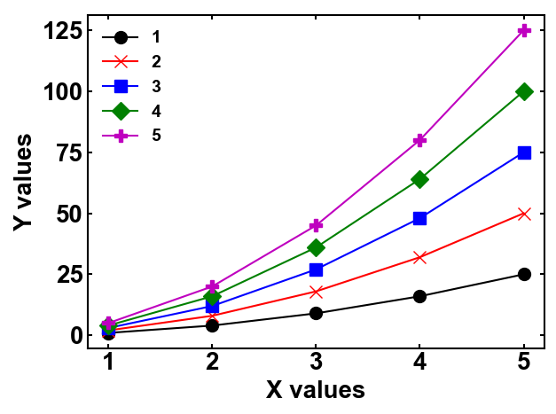

# ebi's style for Matplotlib



## インストール

pipでインストールできます。

```bash
pip install ebi_mpl
```

## 使い方

`plt.style.use("ebi_mpl.lab")` をスクリプトの先頭に挿入することで、スタイルが適用されます。

利用例:

```python
import matplotlib.pyplot as plt
plt.style.use("ebi_mpl.lab")

x = [1, 2, 3, 4, 5]
y = [1, 4, 9, 16, 25]

plt.plot(x, y, label='1')
plt.xlabel("X label")
plt.ylabel("Y label")
plt.legend()
plt.tight_layout()
plt.show()
```
